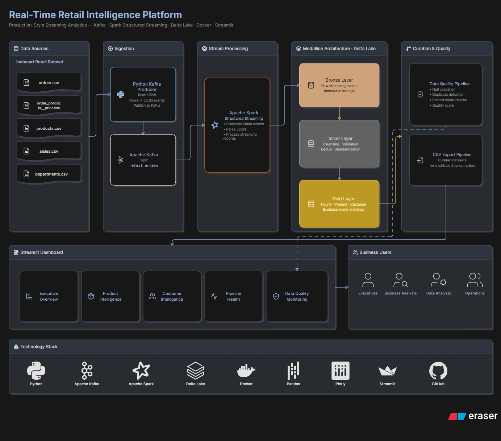
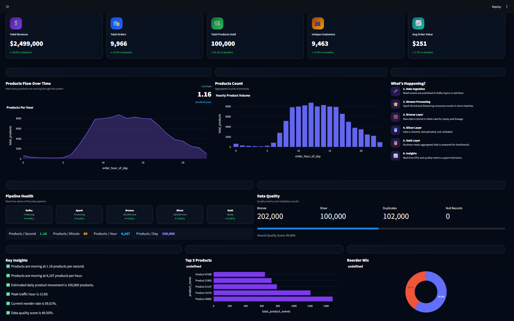

# 🚀 Real-Time Retail Intelligence Platform

Production-inspired streaming analytics platform built with **Apache Kafka**, **Apache Spark Structured Streaming**, **Delta Lake**, **Docker**, and **Streamlit**.

### End-to-End Streaming Data Engineering Platform using Apache Kafka, Apache Spark, Delta Lake & Streamlit


---

## 📖 Overview

This project demonstrates a **production-inspired real-time data engineering platform** that ingests retail order events through Apache Kafka, processes streaming data using Apache Spark Structured Streaming, stores curated datasets in Delta Lake following the **Medallion Architecture (Bronze → Silver → Gold)**, and delivers interactive business intelligence through a modern Streamlit dashboard.

The platform simulates how enterprise retailers build scalable analytics systems capable of supporting operational reporting, customer intelligence, and product performance monitoring in near real time.

---

## 💼 Business Problem

Retail companies generate millions of order events every day from websites, mobile applications, and point-of-sale systems.

Traditional batch ETL pipelines introduce delays that prevent business users from monitoring sales activity, customer behavior, and inventory trends in real time.

Organizations require a scalable streaming architecture capable of:

- Ingesting high-volume retail events
- Processing streaming data continuously
- Maintaining high-quality analytical datasets
- Delivering real-time dashboards
- Supporting operational decision-making

---

## 💡 Solution

This project implements a complete streaming analytics platform that:

- Streams retail order events using Apache Kafka
- Processes events with Spark Structured Streaming
- Implements Bronze, Silver, and Gold layers using Delta Lake
- Performs automated data quality validation
- Exports curated analytical datasets
- Presents executive dashboards through Streamlit
- Uses Docker for reproducible deployment

---

# 🏗️ System Architecture

The platform follows a production-inspired streaming architecture that ingests retail events through **Apache Kafka**, processes streaming data using **Apache Spark Structured Streaming**, stores curated datasets using the **Delta Lake Medallion Architecture (Bronze → Silver → Gold)**, performs automated **data quality validation**, and delivers interactive business intelligence through **Streamlit**.

<p align="center">
    
</p>

---

# 📁 Project Structure

```text
Real-Time-Retail-Intelligence-Platform
│
├── assets/
│   └── architecture.png
│
├── dashboards/
│   └── streamlit_app.py
│
├── src/
│   ├── consumers/
│   ├── models/
│   ├── pipelines/
│   ├── producers/
│   └── utils/
│
├── docker-compose.yml
├── requirements.txt
├── README.md
└── .gitignore
```

---

# 📊 Executive Dashboard

The Streamlit dashboard provides real-time operational visibility into the retail streaming platform through interactive analytics, KPI reporting, and pipeline monitoring.

### Dashboard Modules

- Executive Overview
- Product Intelligence
- Customer Intelligence
- Pipeline Health
- Data Quality Monitoring

<p align="center">
    
</p>

---

# 🛠️ Technology Stack

| Category | Technologies |
|-----------|--------------|
| Programming | Python |
| Streaming | Apache Kafka |
| Processing | Apache Spark Structured Streaming |
| Storage | Delta Lake |
| Data Processing | Pandas |
| Visualization | Streamlit, Plotly |
| Containerization | Docker |
| Version Control | Git & GitHub |

---

# ⭐ Key Features

- Real-Time Kafka Producer
- Kafka Consumer
- Spark Structured Streaming
- Delta Lake Storage
- Bronze Layer (Raw Data)
- Silver Layer (Validated & Cleaned Data)
- Gold Layer (Business Aggregations)
- Automated Data Quality Validation
- Pipeline Health Monitoring
- CSV Export Pipeline
- Executive Analytics Dashboard
- Product Intelligence Dashboard
- Customer Intelligence Dashboard
- Interactive KPI Visualizations

---

# 🚀 Getting Started

## Clone Repository

```bash
git clone https://github.com/saithanuj2/Real-Time-Retail-Intelligence-Platform.git
cd Real-Time-Retail-Intelligence-Platform
```

## Install Dependencies

```bash
pip install -r requirements.txt
```

## Start Docker Services

```bash
docker-compose up -d
```

## Run Kafka Producer

```bash
python src/producers/kafka_producer.py
```

## Run Bronze Pipeline

```bash
spark-submit src/pipelines/bronze_pipeline.py
```

## Run Silver Pipeline

```bash
spark-submit src/pipelines/silver_pipeline.py
```

## Run Gold Pipeline

```bash
spark-submit src/pipelines/gold_pipeline.py
```

## Launch Streamlit Dashboard

```bash
streamlit run dashboards/streamlit_app.py
```

---

# 🚀 Future Enhancements

- Real-time anomaly detection
- Kafka monitoring dashboard
- Kubernetes deployment
- CI/CD using GitHub Actions
- Cloud deployment (AWS, Azure, or GCP)
- Machine learning–based demand forecasting
- Real-time alerting and notifications

---

# 👤 Author

**Sai Thanooj Kumar Revuru**

🎓 Master's in Data Science – University at Buffalo


---

## ⭐ If you found this project interesting, consider giving it a star!